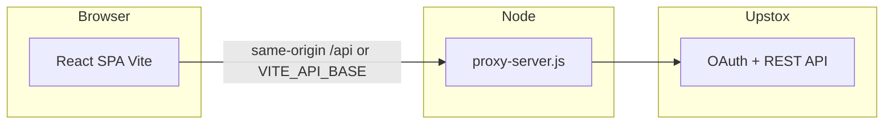

# Four Walls Trading System — Project Documentation

Single-page **React** app plus **Node (Express)** proxy for **Upstox**. Primary feature: **Nifty futures open-interest (OI)** monitoring with timed snapshots and optional strategy UI shell.

---

## 1. Architecture

- **Development:** Vite serves the SPA (usually `:5173`); Express serves `/api/*` (usually `:3000`). `vite.config.js` proxies `/api` to the proxy for convenience.
- **Production:** `npm run build`; `NODE_ENV=production node proxy-server.js` serves static files from `dist/` and all `/api` routes on one port (often behind **nginx**; see `deploy/nginx.conf` and `deploy/ecosystem.config.cjs`).

---

## 2. User interface

| Area | Description |
|------|-------------|
| **Login** | Upstox OAuth; success returns to `FRONTEND_URI` with `?token=…`; token is normalized and stored in `localStorage` (`AuthContext`). |
| **Shell** | Dark sidebar (`AppShell`): **Dashboard** → OI Monitor, **Trading → Options** → strategy control page (UI placeholder; wire execution separately). Sign out clears the stored token. |
| **Top bar** | Instrument label, **LTP** + day change (polled about every **5 seconds** when logged in). |
| **OI Monitor** | Live OI from **REST polling** (`useUpstoxPolling`, 5s). **Connect** starts the session timer. |

---

## 3. OI snapshot history (browser)

- Snapshots are taken on a **3-minute** cadence (aligned to an internal anchor; see `OIMonitor.jsx`).
- Each row: time, OI, change vs first snapshot of the session, change % vs previous snapshot, LTP.
- **Persistence:** `localStorage`, key prefix `oi_change_history:<instrument_key>`.
- **Retention:** up to **`OI_HISTORY_MAX_ROWS`** (currently **200**) rows per instrument — long history stays in-browser only unless you add a server DB.

Clearing site data or another browser loses history.

---

## 4. Authentication

1. User clicks **Login with Upstox** → `GET /api/auth/login` → redirect to Upstox.
2. Upstox redirects to `UPSTOX_REDIRECT_URI` → `GET /api/auth/callback` exchanges `code` for `access_token`.
3. Server redirects to `FRONTEND_URI?token=<access_token>`; client strips query and saves the token.

**Requirements:** `UPSTOX_API_KEY`, `UPSTOX_API_SECRET`, and `UPSTOX_REDIRECT_URI` must match the Upstox developer app **exactly** (including scheme, host, path, trailing slash policy).

---

## 5. Environment variables

| Variable | Role |
|----------|------|
| `UPSTOX_API_KEY` / `UPSTOX_API_SECRET` | OAuth client credentials |
| `UPSTOX_REDIRECT_URI` | Registered callback URL (e.g. `http://localhost:3000/api/auth/callback`) |
| `FRONTEND_URI` | Where the user lands with `?token=` after login |
| `PORT` | Express port (default `3000`) |
| `NODE_ENV` | `production` enables serving `dist/` |
| `VITE_API_BASE` | Optional; set when the SPA must call a different API origin |
| `VITE_INSTRUMENT_KEY` | Optional default future key if discover is unavailable (dev) |

Use **`.env`** or **`.env.local`** at the project root for the proxy; copy from `.env.example` / `env.local.template`.

---

## 6. npm scripts

| Script | Purpose |
|--------|---------|
| `npm run dev` | Vite dev server |
| `npm run proxy` | Express API + Upstox proxies |
| `npm run build` | Production frontend build → `dist/` |
| `npm run preview` | Preview build (with `/api` proxy in config) |
| `npm run lint` | ESLint |

---

## 7. API surface (selected)

All authenticated market routes expect **`Authorization: Bearer <access_token>`** unless noted.

| Method | Path | Notes |
|--------|------|--------|
| GET | `/api/health` | Liveness |
| GET | `/api/auth/login` | Start OAuth |
| GET | `/api/auth/callback` | OAuth code exchange |
| GET | `/api/tools/discover-nifty-future` | Current Nifty future from master list |
| GET | `/api/quotes?instrument_keys=…` | Market quotes |
| POST | `/api/order/place` | Place order (proxy to Upstox) |
| … | … | Additional order / portfolio / trade-setup routes in `proxy-server.js` |

---

## 8. CI / deploy

- GitHub Actions workflow: **`.github/workflows/deploy-ackpat-ci-cd.yml`** — **lint + build** on PR/pushes; **EC2 deploy** after success on **`main`** (SSH/rsync + PM2; see workflow file).
- **AWS:** `deploy/cloudformation.yaml`, `deploy/cloudformation-alb-https.yaml`, `deploy/nginx.conf`, `deploy/ecosystem.config.cjs`.

---

## 9. Troubleshooting

| Symptom | Check |
|---------|--------|
| Login fails / redirect error | `UPSTOX_REDIRECT_URI` vs Upstox dashboard; HTTPS in production |
| No quotes / OI | Valid token; instrument key; Network tab on `/api/quotes` |
| Discover 503 | Server must download `https://assets.upstox.com/.../complete.json.gz` |
| History empty | Connect/live session; wait for first 3-minute tick; ensure not incognito with storage blocked |

---

## 10. Order Placement Bot API

`proxy-server.js` now includes a lightweight in-memory order bot for repeated order placement.

- Safe by default: `dry_run=true` (simulates order sends, no live order).
- Set `dry_run=false` to place real orders through Upstox `v2/order/place`.
- Bot state is process-memory only; restart clears running bots/history.

### Start a bot

`POST /api/bot/order/start`

Body fields:
- `instrument_token`, `quantity`, `product`, `validity`, `order_type`, `transaction_type` (required)
- `interval_sec` (default `180`)
- `max_orders` (default `20`)
- `dry_run` (default `true`)
- Optional: `price`, `trigger_price`, `disclosed_quantity`, `is_amo`, `tag`, `bot_id`

### Monitor / control

- `GET /api/bot/order/list` — all bots
- `GET /api/bot/order/:botId/status` — detailed status + logs
- `POST /api/bot/order/:botId/stop` — stop a bot

---

## 11. License

See repository `README.md` (MIT).
